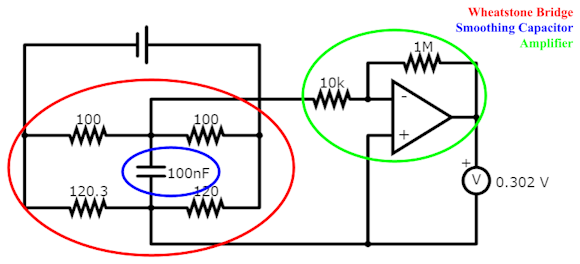

# cryo-spring

Analyzing material stress in space telescope cryocooler springs to extend their lifetime.

## Problem

Cryocoolers in space instruments cool detectors and superconducting devices to cryogenic temperatures. Inside a cryocooler, a flexure spring ensures the cryocooler piston is axially free and radially restricted to prevent off-axis forces. This element prevents the piston from creating friction with the compressor through contact and is critical to cryocooler operation. In Stirling cryocoolers, flexure springs must stabilize 30-60 Hz oscillations for decades. Given that the flexure spring is mission-critical to the cryocooler operation yet prone to failure, its lifetime can determine the lifetime of the space mission. By improving the flexure spring design, space missions can be extended and present longer reliability.

## Design

This project studies various flexure spring designs for long lifetime.

The first design I considered is the traditional spiral flexure spring design with 6 arms. At regions of sharp corners, circular cutouts called "teardrops" are used to spread out stress concentration. The main design parameters are number of spiral arms, and teardrop size.

The alternative considered is a kirigami-based design. It has multiple concentric rings of cuts, with "bridges" connecting individual sections. The main design parameters are number of concentric rings, and arc angle of each connecting bridge.

To compare effectiveness, I use both computer simulations on SolidWorks and experimentation with physical models.

## SolidWorks Simulation

SolidWorks is a software that permits computer-aided design (CAD) modeling, solid modeling, structural engineering, and complex simulations through FEA modeling, an analysis method for the effect of forces on real-world bodies. For this study, SolidWorks Simulation Studies was utilized to study the regional stress of the flexure spring, and SolidWorks Fatigue Studies to investigate the life and damage of flexure spring designs operating under SHM.  In this study, FEA is performed on spiral flexure springs.
Firstly, we used two types of Simulation Studies: stroke and frequency. The former analyzed stress for varying displacements. The latter calculated the resonance frequency of the flexure spring. The stress used to evaluate the designs was the von Mises stress, which is used to evaluate when a material yields.

The above figure shows the result of Solidworks Simulation Study for an axial displacement of 2mm for each flexure spring design: the spiral flexure spring, and three kirigami-inspired designs with 3, 4, and 5 concentric rings of cuts. The blue color shows regions of low stress, green shows moderate stress, and red shows regions of high stress.

## Parametrization

To understand how the stress varied in accordance with design parameters, we used Design Studies to parameterize variables such as the number of spiral arms, size of teardrops, thickness, and amplitude, the results of which will be discussed in the following analysis section. The von Mises Stress is assessed to analyze the stress induced upon a flexure spring. 

The above figure is a 3-dimensional graph of the maximum stress for a 4mm amplitude with varying number of arms and teardrop diameter. The highest stresses are near low arm numbers with low teardrop diameters and high arm number with high teardrop diameter. The teardrop diameter where the maximum stress varies the least as the number of arms changes is around 2mm, and the number of arms where the maximum stress varies the least as the number of arms changes is around $2. The lowest maximum stress is 398.6MPa, at 17 arms and 1mm teardrop diameter.

## Physical Experiments

My initial experiments featured kirigami designs with 5 rings of concentric cuts. Initial tests showed that this design did not hold up because the effective arms were too thin. In our physical experiments, we tested alternatives with 3 and 4 concentric rings. Our design with 3 rings had the most similar effective arm width to the industry-standard spiral flexure spring with 6 arms.

In physical experiments, I aimed to compare the maximum stress in each design. Stress was not possible to measure due to equipment limitations, so I used strain gauges instead. Since strain and stress are proportional in elastic deformation, a comparison of maximum strain can be used to infer the relative differences in stress.

I designed this circuit to convert the strain gauge’s resistance changes into readable voltage. The strain gauge is sensitive but the change in resistance is imperceptible if measured directly. From experimentation, the strain gauge's output range is 0.1 ohms and nominal resistance is 120 ohms. 

In the circuit, the bottom-left resistor represents the strain gauge. First, I used a Wheatstone bridge to convert the resistance into a voltage measurement between 3-8 mV. To reduce AC noise, I added a 100 nF smoothing capacitor. Finally, a non-inverting amplifier circuit with a gain of 100 amplifies the millivolt signal into a signal in the hundreds of millivolts that can be read by a voltmeter. The circuit diagram was created using Paul Falstad’s Circuit Simulator Applet. View the circuit online: https://tinyurl.com/yz79fvkj

The result was that even a few grams placed on the flexure spring could be measured as a change in voltage, with a proportionality of about 1 mV/g. Measuring the result, I was able to confirm that the kirigami-inspired design with 3 rings had 7% lower maximum stress than the spiral industry design.

## Future Work

Future work includes conducting SolidWorks Design Studies on the kirigami design parameters and developing similarly nuanced claims about the effect of kirigami spring design on lifetime.

Other pathways for future investigation include:
1. For cryocooler designs that require higher spring constants, an increased level of stress may be unavoidable. Additional investigation should be done to investigate the proportionality between reaction force and stress.
2. Even though decreasing the thickness of the spring continuously decreases the maximum stress, it is unlikely that damage scales down similarly in the real world due to instability issues. Further investigation should be undertaken to find the relationship between maximum damage as thickness and amplitude vary.
3. For many cryocooler designs, the resonant frequency is a core component of the thermodynamic cycle. In these cases, the resonant frequency of the spring must match a particular frequency for optimal cryocooler operation. Future investigation includes comparing different spring designs that have the same resonant frequency.

## Acknowledgement

Dr. Hannah Rana at the [Harvard–Smithsonian Center for Astrophysics](https://www.cfa.harvard.edu/) provided the original spiral flexure spring model in SolidWorks. She guided me in the kirigami design and the publication of _[Stress Analysis of Stirling Cryocooler Flexure Springs for Long Space Mission Lifetime](./cec25_paper.pdf)_ at [Cryogenic Engineering Conference (CEC) 2025](https://www.cec-icmc.org/2025/).

Dr. Carl S. Kirkconnel shared thoughts on the potential weaknesses of the kirigami spring design at CEC 2025. This will be a direction of future work.

## Sources

Original CAD model for spiral flexure spring provided by Dr. Rana

[Software]
SolidWorks Design Premium for Students
SolidWorks Design Help: “Stress-Life Cycle (S-N) Curve” and “Theory of Cumulative Damage”
SolidWorks Simulation, SolidWorks Fatigue
Python (Matplotlib), Jupyter Notebook, Google Colab
Paul Falstad’s Circuit Simulator Applet

[Materials and Circuit Components]
Resistors: 10, 100, 10k, 1M ohm
Capacitors: 100 nF
Breadboards & jumper wires
Guoelephant M40 Instant Adhesive
Arduino ESP8266
Optix Acrylic Sheets
SHUATI Slotted Weight Set
BF120-10AA, BF350-3AA Strain Gauges

[Devices & ICs]
LM358 Operational Amplifier (Low-Power, Single-Rail)
Kaiweets KM100 Digital Multimeter
FNIRSI 2C53T Multimeter
xTools P2S Laser Cutter at public library

[Key References]
1. R Radebaugh. “Cryocoolers: the state of the art and recent developments*”. In: J. Phys.: Condens. Matter 21.16 (Mar. 2009), p. 164219. doi: 10.1088/0953-8984/21/16/164219.
2. H Rana et al. “Compressor stroke and frequency response measurements using strain gauges”. In: Cryocoolers 22: Proceedings of the International Cryocooler Conference. pp. 211. Boulder, CO: International Cryocooler Conference, Inc., 2022.
3. SolidWorks. SolidWorks User Manual. Dassault Systemes. 2024.
4. A T A M de Waele. “Basic operation of cryocoolers and related thermal machines”. In: J. Low Temp. Phys. 164.5 (2011), pp. 179–236. doi: 10.1007/s10909-011-0373-x.
5. A S Gaunekar, T G¨oddenhenrich, and C Heiden. “Finite element analysis and testing of flexure bearing elements”. In: Cryogenics 36.5 (1996), pp. 359–364. doi: https://doi.org/10.1016/0011-2275(96)81106-4.
